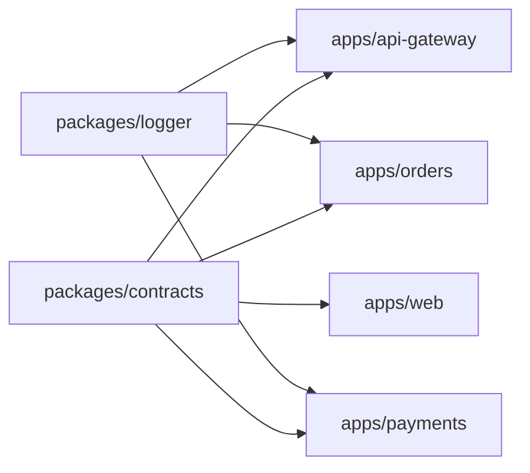

# Acme Commerce — Qovery microservices monorepo

This repository is a small, production-shaped reference for running independently deployable services from one Git repository on Qovery.

The important boundary is simple:

- `apps/` contains deployable applications and lifecycle jobs.
- `packages/` contains shared code that is never deployed by itself.
- `infra/qovery/` describes stages, services, migration jobs, and MATCH deployment restrictions.

```text
.
├── apps/
│   ├── api-gateway/
│   │   ├── Dockerfile
│   │   └── src/
│   ├── orders/
│   │   ├── Dockerfile
│   │   ├── migrations/
│   │   └── src/
│   ├── payments/
│   │   ├── Dockerfile
│   │   ├── migrations/
│   │   └── src/
│   └── web/
│       ├── Dockerfile
│       └── src/
├── packages/
│   ├── contracts/
│   ├── config/
│   └── logger/
├── infra/qovery/
│   ├── modules/
│   └── environments/
├── .github/
├── .dockerignore
├── turbo.json
└── pnpm-lock.yaml
```

## Dependency rules

Applications may import shared packages. An application must not import another application. Runtime collaboration happens through versioned APIs or events.



## Local workflow

```bash
npm install --global pnpm@10.15.1
pnpm install
pnpm build
pnpm test
```

Build a service image from the repository root so the Docker context includes shared packages:

```bash
docker build -f apps/orders/Dockerfile -t orders:test .
```

## Qovery model

| Layer | Stage | Components |
| --- | --- | --- |
| Data | `databases` | Service-owned databases |
| Schema | `migrations` | Orders and payments lifecycle jobs |
| Domain | `core-services` | Orders and payments, deployed in parallel |
| Edge | `edge` | API gateway and web |

Each application and migration job has its own MATCH path list. See [`infra/qovery/environments/staging/main.tf`](infra/qovery/environments/staging/main.tf).

## Screenshot map

1. Repository tree: open the Explorer with `apps/`, `packages/`, and `infra/qovery/` expanded.
2. Build settings: use `apps/orders/Dockerfile` and leave the Qovery Root Application Path empty.
3. Deployment Restrictions: use the `orders_match_paths` local in the staging Terraform configuration.
4. Terraform plan: capture the `orders` module and its stage/restriction inputs.
5. Pipeline: render [`docs/deployment-pipeline.mmd`](docs/deployment-pipeline.mmd).
6. Preview Environment: use the staging environment as the Blueprint and keep optional services skipped.
